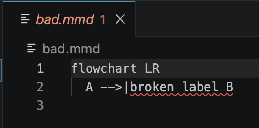

# mermaid-lint

Validate Mermaid diagrams embedded in Markdown files. Uses the official `mermaid.parse()` API — catches real syntax errors, not just missing diagram-type keywords.

**[jasonworden.com/mermaid-lint](http://jasonworden.com/mermaid-lint)**

[](https://www.npmjs.com/package/@mermaid-lint/cli)
[](https://www.npmjs.com/package/@mermaid-lint/cli)
[](https://github.com/jasonworden/mermaid-lint/actions/workflows/ci.yml)
[](https://opensource.org/licenses/MIT)

Catches real syntax errors as you type — here the [VS Code extension](packages/vscode) flagging an unterminated edge label in a `.mmd` file:



## Packages

| Package | npm | Description |
|---|---|---|
| [`@mermaid-lint/cli`](packages/cli) | [](https://www.npmjs.com/package/@mermaid-lint/cli) | CLI — `npx mermaid-lint` |
| [`@mermaid-lint/remark`](packages/remark) | [](https://www.npmjs.com/package/@mermaid-lint/remark) | remark-lint plugin |
| [`@mermaid-lint/markdownlint`](packages/markdownlint) | [](https://www.npmjs.com/package/@mermaid-lint/markdownlint) | markdownlint async custom rule |
| [`@mermaid-lint/textlint`](packages/textlint) | [](https://www.npmjs.com/package/@mermaid-lint/textlint) | textlint rule (async) |
| [`@mermaid-lint/vitest`](packages/vitest) | [](https://www.npmjs.com/package/@mermaid-lint/vitest) | Vitest adapter |
| [`@mermaid-lint/jest`](packages/jest) | [](https://www.npmjs.com/package/@mermaid-lint/jest) | Jest adapter |
| [`@mermaid-lint/core`](packages/core) | [](https://www.npmjs.com/package/@mermaid-lint/core) | Core utilities (extract, validate, discover) |
| [`mermaid-lint-vscode`](packages/vscode) | _(unreleased)_ | VS Code extension — live squiggles for `.md` + `.mmd` |

## CLI

```bash
npx mermaid-lint                        # validate git-tracked *.md / *.mdx / *.markdown / *.mmd
npx mermaid-lint --all                  # scan every supported file on disk
npx mermaid-lint "docs/**/*.md"         # glob pattern (quoted to prevent shell expansion)
npx mermaid-lint --include "docs/**/*.md" --exclude "docs/archive/**"  # named glob flags
npx mermaid-lint --ext crv              # also discover *.crv files (Carve, etc.)
npx mermaid-lint docs/page.crv          # explicitly-named files lint regardless of extension
npx mermaid-lint -                      # read from stdin
npx mermaid-lint --no-gitignore         # scan filesystem (include gitignored files)
npx mermaid-lint --quiet                # failures only
npx mermaid-lint --format json          # machine-readable JSON output
npx mermaid-lint --strict               # treat semantic warnings as errors (exit 1)
npx mermaid-lint --no-semantic          # skip semantic checks (syntax errors only)
npx mermaid-lint --fix                  # auto-fix mechanical errors in git-tracked files
npx mermaid-lint --fix "docs/**/*.md"   # fix only specific files
```

**Exit codes:** `0` = all valid · `1` = validation failures (or warnings with `--strict`) · `2` = usage/IO error

### JSON output schema

```json
{
  "version": "0.10.0",
  "files": [
    {
      "path": "docs/api.md",
      "diagrams": [
        { "line": 42, "col": 1, "type": "flowchart", "ok": true,
          "warnings": [{ "rule": "duplicate-ids", "message": "node \"A\" declared with label \"Start\" (line 2) and \"Begin\" (line 7)", "line": 7 }] },
        { "line": 89, "col": 1, "type": "sequenceDiagram", "ok": false,
          "error": { "message": "Expecting 'SPACE'", "line": 2, "col": 5 }, "warnings": [] }
      ]
    }
  ],
  "summary": {
    "files": 5, "diagrams": 12, "ok": 10, "errors": 2, "warnings": 1,
    "types": { "flowchart": 6, "sequenceDiagram": 3, "classDiagram": 3 }
  }
}
```

### Usage in non-JavaScript projects

mermaid-lint only requires Node.js ≥20 — it works in any project regardless of language.

**Python / Go / Rust / any project with Markdown docs:**

```bash
# Validate all Markdown in a docs/ folder
npx mermaid-lint "docs/**/*.md"

# Scan everything recursively (no git required)
npx mermaid-lint --all

# Machine-readable output for CI scripts
npx mermaid-lint --format json --all | python -c "
import sys, json
out = json.load(sys.stdin)
if out['summary']['errors']:
    for f in out['files']:
        for d in f['diagrams']:
            if not d['ok']:
                print(f\"{f['path']}:{d['line']}: {d['error']['message']}\")
    sys.exit(1)
"
```

**Pre-commit hook (any language):**

```yaml
# .pre-commit-config.yaml
repos:
  - repo: local
    hooks:
      - id: mermaid-lint
        name: Validate Mermaid diagrams
        language: node
        entry: npx mermaid-lint
        types: [markdown]
        pass_filenames: true
```

**Pre-commit hook (Node.js / JavaScript projects):**

Use [husky](https://typicode.github.io/husky/) + [lint-staged](https://github.com/lint-staged/lint-staged) to run mermaid-lint on only the staged Markdown files before every commit.

```bash
npm install --save-dev husky lint-staged
npx husky init
```

Add to `package.json`:

```json
{
  "lint-staged": {
    "*.{md,mmd,mdx}": "mermaid-lint"
  }
}
```

Set `.husky/pre-commit` to:

```sh
npx lint-staged
```

lint-staged passes staged file paths as positional arguments — mermaid-lint validates each file directly.

## GitHub Actions

```yaml
- uses: jasonworden/mermaid-lint-action@v1
  with:
    files: 'docs/**/*.md **/*.mmd'
    strict: true
```

See [mermaid-lint-action](https://github.com/jasonworden/mermaid-lint-action) for full options and inline PR annotation support.

## Configuration

mermaid-lint auto-discovers a config file in your project root. Supported names (in priority order):

- `mermaid-lint.config.js` / `.cjs` / `.mjs`
- `.mermaidlintrc` / `.mermaidlintrc.json`
- `.mermaidlintrc.js` / `.cjs` / `.mjs`
- `package.json` → `"mermaidLint"` field

CLI flags always override config values. A starter template is provided at [`mermaid-lint.config.example.js`](mermaid-lint.config.example.js).

```js
// mermaid-lint.config.js
export default {
  // Glob patterns to validate (used when no CLI paths given and --all not set)
  files: ['docs/**/*.md', '**/*.mmd'],

  // Glob patterns to exclude
  ignore: ['node_modules/**', 'dist/**'],

  // Treat semantic warnings as errors — equivalent to --strict
  strict: false,

  // false disables semantic checks — equivalent to --no-semantic
  semantic: true,

  // 'text' (default) or 'json'
  format: 'text',

  // Code-fence markers to recognize. Defaults to both, matching CommonMark:
  //   'backtick' → ```mermaid … ```
  //   'tilde'    → ~~~mermaid … ~~~
  // Restrict to ['backtick'] to ignore tilde fences.
  fences: ['backtick', 'tilde'],
};
```

Or as JSON in `.mermaidlintrc.json`:

```json
{
  "files": ["docs/**/*.md"],
  "ignore": ["dist/**"],
  "strict": true
}
```

Or inline in `package.json`:

```json
{
  "mermaidLint": {
    "ignore": ["dist/**"],
    "strict": true
  }
}
```

## remark

```ts
import { remark } from 'remark';
import remarkLint from 'remark-lint';
import remarkLintMermaid from '@mermaid-lint/remark';

const result = await remark()
  .use(remarkLint)
  .use(remarkLintMermaid)
  .process(markdown);

// result.messages contains any mermaid validation errors
```

Or in `.remarkrc.mjs` to run from the command line (`npx remark --frail .`):

```js
export default {
  plugins: [
    'remark-lint',
    '@mermaid-lint/remark',
  ]
};
```

Enable strict mode (treat semantic warnings as errors):

```js
export default {
  plugins: [
    'remark-lint',
    ['@mermaid-lint/remark', { strict: true }],
  ]
};
```

## markdownlint

A [markdownlint](https://github.com/DavidAnson/markdownlint) async custom rule
that validates Mermaid blocks as part of your existing markdownlint run — in CI,
on the command line, and inline in VS Code.

### What this provides today

| Surface | Supported | Notes |
|---|---|---|
| ```` ```mermaid ```` blocks in **Markdown** (`.md`, `.markdown`, …) | ✅ | CLI, CI, and in-editor squiggles |
| Standalone **`.mmd`** diagram files | ❌ | markdownlint only processes Markdown; it never invokes the rule on `.mmd`. Use the [VS Code extension](#vs-code-extension) for `.mmd` coverage in the editor. |
| Zero-config editor setup | ❌ | requires the steps below (npm install + setting + workspace trust) |

### CLI / CI usage

```bash
npm install --save-dev @mermaid-lint/markdownlint markdownlint-cli2
```

```js
// .markdownlint-cli2.mjs
export default {
  config: { default: true },
  customRules: ['@mermaid-lint/markdownlint'],
};
```

Run it: `npx markdownlint-cli2 "**/*.md"`. Use **`markdownlint-cli2 >= 0.17.0`** —
earlier versions bundle a `markdownlint` older than `0.37`, which predates async
custom rules, so the rule is **silently skipped** (zero errors reported).

### VS Code (inline squiggles, no separate extension)

Install the [markdownlint extension](https://marketplace.visualstudio.com/items?itemName=DavidAnson.vscode-markdownlint)
(**v0.50+**; it bundles a recent `markdownlint-cli2`, so async rules run), add the
package to your workspace (`npm i -D @mermaid-lint/markdownlint`), then in
`.vscode/settings.json`:

```json
{
  "markdownlint.customRules": ["./node_modules/@mermaid-lint/markdownlint"]
}
```

You must **trust the workspace** — the extension blocks custom-rule JavaScript in
untrusted workspaces. Invalid ```` ```mermaid ```` blocks in `.md` files then get
inline diagnostics as you type. (`.mmd` files are not covered — see the table
above.)

Requires `markdownlint >= 0.37.0` for async custom rule support.

## textlint

A [textlint](https://textlint.org) rule that validates ```` ```mermaid ````
blocks as part of a textlint run. textlint awaits a Promise returned from a rule,
so — unlike ESLint, whose rules are synchronous — it runs the **full** async
validator (merman + mermaid.js), the same engine the CLI uses.

```bash
npm install --save-dev textlint @textlint/textlint-plugin-markdown @mermaid-lint/textlint
```

```js
// .textlintrc.js
module.exports = {
  plugins: ['@textlint/markdown'],
  rules: {
    '@mermaid-lint/textlint': true,
  },
};
```

Run it: `npx textlint "**/*.md"`. Pass `{ strict: true }` to also report semantic
warnings (e.g. duplicate node IDs):

```js
rules: {
  '@mermaid-lint/textlint': { strict: true },
},
```

> **Why textlint and not ESLint?** ESLint rules must be synchronous, so they
> cannot run Mermaid's async parser. See the
> [parsing-vs-linting explainer](docs/parsing-vs-linting.md) and tracking issues
> [#39](https://github.com/jasonworden/mermaid-lint/issues/39) (ESLint) and
> [#38](https://github.com/jasonworden/mermaid-lint/issues/38) (Biome).

## VS Code extension

A dedicated extension (`mermaid-lint-vscode`, in [`packages/vscode`](packages/vscode))
that validates Mermaid as you type and reports errors inline — no markdownlint
setup required, and unlike the markdownlint rule it **also covers standalone
`.mmd` files**.

| Feature | |
|---|---|
| Inline squiggles on invalid ```` ```mermaid ```` blocks in **Markdown** | ✅ |
| Inline squiggles in standalone **`.mmd`** files | ✅ |
| Hover messages + **Problems panel** entries | ✅ |
| Debounced **on-type** validation | ✅ |
| Respects the [mermaid-lint config file](#configuration) (`strict`, `semantic`) | ✅ |
| **Quick-fix** code actions (apply `--fix` autocorrections in-editor) | ✅ |

Settings:

```json
{
  "mermaidLint.enable": true,
  "mermaidLint.delay": 300
}
```

`strict` and `semantic` behavior comes from your project's mermaid-lint config
file (e.g. `.mermaidlintrc`), so the editor matches the CLI.

**Install:** published to the
[VS Code Marketplace](https://marketplace.visualstudio.com/items?itemName=mermaid-lint.mermaid-lint-vscode)
and [Open VSX](https://open-vsx.org/extension/mermaid-lint/mermaid-lint-vscode)
(Cursor / VSCodium / Windsurf / Gitpod) as `mermaid-lint.mermaid-lint-vscode` —
search _Mermaid Lint_ in the Extensions panel, or
`code --install-extension mermaid-lint.mermaid-lint-vscode`. Release and
double-publish steps are in [`packages/vscode/PUBLISHING.md`](packages/vscode/PUBLISHING.md).

## Vitest

```ts
// mermaid.test.ts
import { defineMermaidTests } from '@mermaid-lint/vitest'

defineMermaidTests()                      // auto-discovers git-tracked *.md
defineMermaidTests({ root: '/my/docs' }) // explicit root
```

## Jest

```ts
// mermaid.test.mjs
import { defineMermaidTests } from '@mermaid-lint/jest'

defineMermaidTests()
```

Requires `NODE_OPTIONS=--experimental-vm-modules` (Jest + native ESM).

## How it works


- **Discovery:** `git ls-files -- '*.md' '*.mdx' '*.markdown' '*.mmd'` by default; `--all` falls back to recursive filesystem scan. Add extensions with `--ext crv,foo` or `extensions: ['crv']` in config to discover other fenced-Markdown file types (e.g. [Carve](https://github.com/markup-carve/carve) `.crv`). Files you name explicitly are always linted, whatever their extension.
- **Extraction:** Parses CommonMark fenced `mermaid` blocks — backtick (` ```mermaid ` ) and tilde (`~~~mermaid`) markers, variable-length fences (4+ chars, so a body can contain ` ``` `), CRLF, indentation, info-strings, and unclosed fences. Restrict recognized markers with the [`fences`](#configuration) config option. Only `.mmd` files are treated as a single whole-file diagram — every other extension uses fenced-block extraction
- **Validation:** Primary pass via [`@mermanjs/web`](https://github.com/Latias94/merman) WASM (Rust, ~3.7–4.4× faster). On any error, falls back to `mermaid.parse()` via jsdom for precise line/col locations and authoritative verdict

## Semantic warnings

In addition to syntax errors, mermaid-lint detects semantic issues that `mermaid.parse()` accepts but which produce broken rendered diagrams.

**Duplicate node IDs with conflicting labels** (flowchart / graph only): Mermaid silently picks one label when the same node ID is declared twice with different labels. mermaid-lint flags the conflict:

```
docs/api.md:7:1: warning: duplicate-ids: node "A" declared with label "Start" (line 2) and "Begin" (line 7)
```

Suppress per-diagram with a Mermaid comment:

```
%% mermaid-lint-disable duplicate-ids
flowchart LR
  A[Start] --> B[End]
```

Or disable globally for a run with `--no-semantic`.

## Diagram types

mermaid-lint validates all 19 Mermaid diagram types using the official `mermaid.parse()` API. Some alternative linters (e.g. [`maid`](https://github.com/egoist/maid)) only validate 5 types and silently pass all input for the other 14 (gantt, erDiagram, journey, mindmap, gitGraph, etc.). Every type in the table below is actively validated — none are pass-through.

| Type | Keyword | Supported | Notes |
|---|---|---|---|
| Flowchart | `flowchart` / `graph` | ✅ | `graph` is an alias for `flowchart` |
| Sequence | `sequenceDiagram` | ✅ | |
| Class | `classDiagram` | ✅ | |
| State | `stateDiagram-v2` | ✅ | |
| Entity-Relationship | `erDiagram` | ✅ | |
| Pie chart | `pie` | ✅ | |
| Gantt | `gantt` | ✅ | |
| Git graph | `gitGraph` | ✅ | |
| User journey | `journey` | ✅ | |
| Mindmap | `mindmap` | ✅ | |
| Quadrant chart | `quadrantChart` | ✅ | |
| Requirement | `requirementDiagram` | ✅ | |
| C4 Context | `C4Context` | ✅ | |
| Timeline | `timeline` | ✅ | |
| XY chart | `xychart-beta` | ✅ | Experimental |
| Sankey | `sankey-beta` | ✅ | Experimental |
| Block | `block-beta` | ✅ | Experimental |
| Packet | `packet-beta` | ✅ | Experimental |
| Architecture | `architecture-beta` | ✅ | Experimental |
| ZenUML | `zenuml` | ❌ | Requires separate [`@mermaid-js/mermaid-zenuml`](https://github.com/mermaid-js/zenuml-core) package; not bundled in mermaid v11 |

## Performance

Benchmarks run on Apple M4 Max (64 GB), Node.js 22. Corpus: one Markdown file with the given number of flowchart diagrams (~1/3 with duplicate-ID conflicts, all syntactically valid). Values are **total ms (ms per diagram)**.

| Diagrams | mermaid-lint v0.3.0 | mermaid-lint v0.5.0 |
|---|---|---|
| 10 | — | 108 ms (10.8 ms/d) |
| 50 | 407 ms (8.1 ms/d) | 121 ms (2.4 ms/d) |
| 200 | 553 ms (2.8 ms/d) | 159 ms (0.8 ms/d) |
| 1000 | 1018 ms (1.0 ms/d) | 260 ms (0.3 ms/d) |
| 10000 | 6643 ms (0.7 ms/d) | 1699 ms (0.2 ms/d) |
| 100000 | 62734 ms (0.63 ms/d) | 15590 ms (0.16 ms/d) |

**v0.5.0 is 3.4–4.0× faster** than v0.3.0. The fixed ~400 ms startup cost (Node.js + mermaid.js) is now eliminated on the happy path: `@mermanjs/web` WASM handles validation with ~100 ms init + ~0.1 ms/diagram. mermaid.js is only loaded when a diagram fails validation, where it supplies precise line/column error locations.

**Validation accuracy:** mermaid-lint uses `@mermanjs/web` (Rust WASM) for the fast path. When merman signals an error, mermaid.js is the authoritative fallback — it provides precise line/col locations and is the final arbiter of validity. Parity between the two parsers is enforced by a CI test suite: a corpus of 24+ valid and 10+ invalid diagrams across all major Mermaid diagram types runs on every PR, failing if merman ever accepts a diagram that mermaid.js rejects. For corpora with parse errors, both runtimes load (~500 ms total).

Run `pnpm bench` to reproduce.

## Development

```bash
pnpm install
pnpm test                              # vitest (core + cli + vitest adapter)
pnpm --filter @mermaid-lint/jest test  # jest adapter
pnpm lint                              # biome
```
