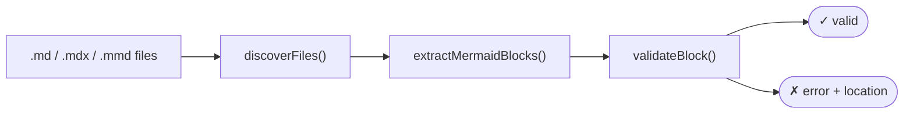

# mermaid-lint

Validate Mermaid diagrams embedded in Markdown files. Uses the official `mermaid.parse()` API — catches real syntax errors, not just missing diagram-type keywords.

## Packages

| Package | npm | Description |
|---|---|---|
| [`@mermaid-lint/cli`](packages/cli) | [](https://www.npmjs.com/package/@mermaid-lint/cli) | CLI — `npx mermaid-lint` |
| [`@mermaid-lint/vitest`](packages/vitest) | [](https://www.npmjs.com/package/@mermaid-lint/vitest) | Vitest adapter |
| [`@mermaid-lint/jest`](packages/jest) | [](https://www.npmjs.com/package/@mermaid-lint/jest) | Jest adapter |
| [`@mermaid-lint/core`](packages/core) | [](https://www.npmjs.com/package/@mermaid-lint/core) | Core utilities (extract, validate, discover) |

## CLI

```bash
npx mermaid-lint               # validate all git-tracked *.md
npx mermaid-lint --all         # scan every *.md on disk
npx mermaid-lint docs/**/*.md  # explicit paths
npx mermaid-lint --quiet       # failures only
```

**Exit codes:** `0` = all valid · `1` = validation failures · `2` = usage/IO error

## Vitest

```ts
// mermaid.test.ts
import { defineMermaidTests } from '@mermaid-lint/vitest'

defineMermaidTests()                      // auto-discovers git-tracked *.md
defineMermaidTests({ root: '/my/docs' }) // explicit root
```

## Jest

```ts
// mermaid.test.mjs
import { defineMermaidTests } from '@mermaid-lint/jest'

defineMermaidTests()
```

Requires `NODE_OPTIONS=--experimental-vm-modules` (Jest + native ESM).

## How it works



- **Discovery:** `git ls-files -- '*.md' '*.mdx' '*.markdown' '*.mmd'` by default; `--all` falls back to recursive filesystem scan
- **Extraction:** Parses fenced ` ```mermaid ``` ` blocks (handles CRLF, indentation, info-strings, unclosed fences); `.mmd` files treated as a single diagram
- **Validation:** Calls `mermaid.parse()` via a lazily-bootstrapped jsdom window — same parser your renderer uses

## Development

```bash
pnpm install
pnpm test                              # vitest (core + cli + vitest adapter)
pnpm --filter @mermaid-lint/jest test  # jest adapter
pnpm lint                              # biome
```
