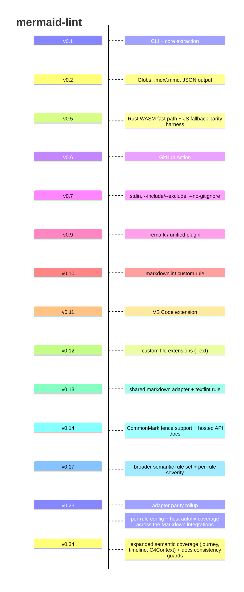

# Release history

This is a selective map of the releases that most changed what mermaid-lint is
or how people use it. It is intentionally not a full changelog.

## What belongs here

Add an entry when a release materially changes mermaid-lint's user-facing
capabilities, integrations, validation model, or maintenance surface.

Good candidates:

- a new integration surface such as the GitHub Action, VS Code extension, or a
  new lint/test runner adapter
- a validation-model change such as the Rust fast path, semantic rules, or a
  new family of supported diagram checks
- a docs or distribution milestone that changes how the project is consumed or
  maintained

## Maintenance

Not every release needs an entry. This page is for notable releases, not for
every minor, patch, or follow-up housekeeping version.

A `vx.y.z` entry can act as a rollup of everything notable since the last
version that already has an entry here; it does not need to represent only
changes shipped in exactly that one version.

When a release is notable enough to change how people describe mermaid-lint in
docs, demos, or release notes, add or update a short entry here in the same
patch.
