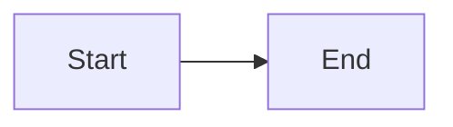

# Semantic Rules

In addition to syntax errors, mermaid-lint runs semantic rules over diagrams
that `mermaid.parse()` accepts but that may be legacy, ambiguous, or render
incorrectly.

Each rule has a severity:

- `off` disables the rule.
- `warn` reports the rule without failing the run unless `--strict` is enabled.
- `error` fails the run outright.

Tune rules through the `rules` config key. Most rules default to `warn`;
`duplicate-ids` defaults to `error` because Mermaid renders the wrong result.

## Rule Reference

| Rule | Default | Flags | Scope |
|---|---|---|---|
| `duplicate-ids` | `error` | Same node id declared twice with conflicting labels; Mermaid silently drops one | flowchart / graph |
| `prefer-flowchart` | `warn` | The legacy `graph` keyword; `flowchart` is current and enables per-subgraph `direction` | graph |
| `require-direction` | `warn` | `flowchart`/`graph` with no direction; silently defaults to `TD` | flowchart / graph |
| `no-experimental` | `warn` | `*-beta` diagram types; unstable syntax that may break on a Mermaid upgrade | all |
| `xychart-missing-x-axis` | `warn` | An `xychart-beta` with one or more series but no `x-axis`; the horizontal scale or labels are implicit | xychart-beta |
| `xychart-missing-y-axis` | `warn` | An `xychart-beta` with one or more series but no `y-axis`; the vertical scale or units are implicit | xychart-beta |
| `xychart-no-series` | `warn` | An `xychart-beta` with no `line [...]` or `bar [...]` series; parses but renders empty | xychart-beta |
| `xychart-series-length-mismatch` | `warn` | An `xychart-beta` whose series lengths do not match each other or a categorical `x-axis` label count | xychart-beta |
| `sankey-non-positive-value` | `warn` | A `sankey-beta` link with a value of `0` or below; the flow has no positive weight | sankey-beta |
| `sankey-duplicate-link` | `warn` | The same `source,target` pair repeated, even with a different value; links stack and the duplicate is usually accidental | sankey-beta |
| `sankey-self-loop` | `warn` | A `sankey-beta` link whose source and target are the same; usually a copy-paste mistake | sankey-beta |
| `block-no-blocks` | `warn` | A `block-beta` diagram with no block declarations; parses but renders empty | block-beta |
| `packet-no-fields` | `warn` | A `packet-beta` diagram with no bit-range field rows; parses but renders empty | packet-beta |
| `packet-empty-labels` | `warn` | A `packet-beta` field with an empty label; renders a blank cell | packet-beta |
| `architecture-no-elements` | `warn` | An `architecture-beta` diagram with no services, groups, or junctions; parses but renders empty | architecture-beta |
| `architecture-no-edges` | `warn` | An `architecture-beta` diagram with declared elements but no edges; usually incomplete | architecture-beta |
| `architecture-duplicate-edge` | `warn` | The same architecture connection defined more than once; usually a copy-paste mistake | architecture-beta |
| `no-duplicate-edges` | `warn` | The same edge defined more than once; renders stacked, usually a copy-paste mistake | flowchart / graph |
| `no-self-loop` | `warn` | A node with an edge to itself (`A --> A`); almost always unintentional | flowchart / graph |
| `no-empty-labels` | `warn` | A node with an empty label (`A[ ]`); renders a blank shape | flowchart / graph |
| `no-orphan-nodes` | `off` | A node declared but never connected by an edge. Off by default because it can false-positive on subgraph-only members | flowchart / graph |
| `no-duplicate-node-declarations` | `warn` | The same node id declared more than once with the same label; usually copy-paste noise | flowchart / graph |
| `no-activate-without-deactivate` | `warn` | An `activate`/`+` with no matching `deactivate`/`-` or vice versa; leaves a dangling activation bar | sequenceDiagram |
| `prefer-explicit-participants` | `off` | A participant used in a message before being declared; Mermaid auto-creates it | sequenceDiagram |
| `sequence-duplicate-participant` | `warn` | The same participant or actor id declared more than once; ordering and labels become ambiguous | sequenceDiagram |
| `class-duplicate-class` | `warn` | The same class declared more than once; Mermaid merges declarations, usually a copy-paste mistake | classDiagram |
| `no-duplicate-methods` | `warn` | The same method signature declared twice on one class; renders both | classDiagram |
| `pie-duplicate-label` | `warn` | The same pie slice label defined more than once; usually a copy-paste mistake | pie |
| `pie-zero-value` | `warn` | A pie slice with a value of `0`; renders as an invisible slice | pie |
| `pie-no-data` | `warn` | A pie chart with no data slices; renders empty | pie |
| `state-duplicate-state` | `warn` | The same state id declared more than once; labels and composite bodies become ambiguous | stateDiagram |
| `state-duplicate-transition` | `warn` | The same `src --> tgt : label` transition defined more than once; renders stacked, usually a copy-paste mistake | stateDiagram |
| `state-empty-composite` | `warn` | A composite `state X { }` with an empty body; renders as an empty box | stateDiagram |
| `state-self-transition` | `off` | A state with a transition to itself (`A --> A`). Off by default because self-transitions are valid and common in state machines | stateDiagram |
| `er-duplicate-attribute` | `warn` | The same attribute name declared twice inside one entity block | erDiagram |
| `er-duplicate-entity` | `warn` | An entity whose attribute block is defined more than once; Mermaid merges them, usually a copy-paste mistake | erDiagram |
| `er-standalone-entity` | `off` | An entity with a defined block but no relationship; renders as an isolated box | erDiagram |
| `gantt-duplicate-task-id` | `warn` | Two tasks declared with the same explicit id; makes `after`/`until` references ambiguous | gantt |
| `gantt-undefined-dependency` | `warn` | A task whose `after`/`until` references an id no task defines; Mermaid places it at the chart start | gantt |
| `gantt-empty-section` | `warn` | A `section` with no tasks; renders as an empty section header | gantt |
| `requirement-duplicate-name` | `warn` | The same requirement or element name defined more than once; relationship and styling targets become ambiguous | requirementDiagram |
| `requirement-duplicate-id` | `warn` | The same requirement `id:` value used more than once; requirement IDs should uniquely identify a single requirement | requirementDiagram |
| `requirement-undefined-reference` | `warn` | A relationship endpoint whose requirement or element name is never defined in the diagram | requirementDiagram |
| `journey-empty-section` | `warn` | A `section` with no tasks; renders as an empty section header | journey |
| `journey-score-out-of-range` | `warn` | A task happiness score outside Mermaid's documented 1-5 scale | journey |
| `journey-task-without-actor` | `warn` | A journey task with no actor; renders without an owner lane and is usually incomplete | journey |
| `journey-no-tasks` | `warn` | A `journey` with no tasks; parses but renders an empty diagram | journey |
| `mindmap-duplicate-sibling` | `warn` | Two child nodes under the same parent with identical text; renders two identical branches, usually a copy-paste mistake | mindmap |
| `mindmap-no-nodes` | `warn` | A `mindmap` with only the keyword and no nodes; parses but renders an empty diagram | mindmap |
| `mindmap-deep-nesting` | `off` | A node nested beyond five levels deep. Off by default because deep nesting is a matter of taste | mindmap |
| `timeline-empty-section` | `warn` | A `section` with no time-period entries; renders as an empty section header | timeline |
| `timeline-empty-event` | `warn` | A time period with a blank event field; renders an empty event bubble | timeline |
| `timeline-no-entries` | `warn` | A `timeline` with no sections and no time periods; parses but renders an empty diagram | timeline |
| `gitgraph-duplicate-commit-id` | `warn` | The same explicit `id:` on more than one commit; makes `merge`/`cherry-pick` references ambiguous | gitGraph |
| `gitgraph-duplicate-tag` | `warn` | The same `tag:` used more than once; two commits render with the same tag | gitGraph |
| `gitgraph-no-commits` | `warn` | A `gitGraph` with no commits; parses but renders an empty diagram | gitGraph |
| `quadrant-duplicate-point` | `warn` | Two data points with the same label; renders overlapping markers, usually a copy-paste mistake | quadrantChart |
| `quadrant-no-points` | `warn` | A quadrantChart with axis or quadrant labels but no data points; parses but renders an empty plot | quadrantChart |
| `quadrant-missing-x-axis` | `warn` | A quadrantChart with data points but no `x-axis` label; default axis text hides chart intent | quadrantChart |
| `quadrant-missing-y-axis` | `warn` | A quadrantChart with data points but no `y-axis` label; default axis text hides chart intent | quadrantChart |
| `quadrant-duplicate-quadrant` | `warn` | The same quadrant region (`quadrant-1`-`quadrant-4`) labeled more than once; Mermaid keeps only the last | quadrantChart |
| `c4-duplicate-id` | `warn` | A C4 element or boundary id declared more than once; duplicate ids make relationships and styles ambiguous | C4Context |
| `c4-undefined-relationship-endpoint` | `warn` | A C4 relationship whose source or target id is not declared | C4Context |
| `c4-undefined-element-style` | `warn` | An `UpdateElementStyle` override that references an undeclared C4 element or boundary id | C4Context |
| `c4-undefined-relationship-style-endpoint` | `warn` | An `UpdateRelStyle` override whose source or target id is not declared | C4Context |

## Example Output

```text
docs/api.md:7:1: error: duplicate-ids: node "A" declared with label "Start" (line 2) and "Begin" (line 7)
docs/api.md:2:1: warning: prefer-flowchart: use `flowchart` instead of `graph`: ...
```

## Suppressions

Suppress one rule for a diagram with a Mermaid comment:



Use a bare `%% mermaid-lint-disable` to suppress all semantic rules in a
diagram, or use `--no-semantic` to disable semantic checks for a run.
