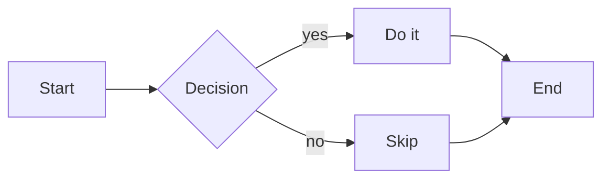
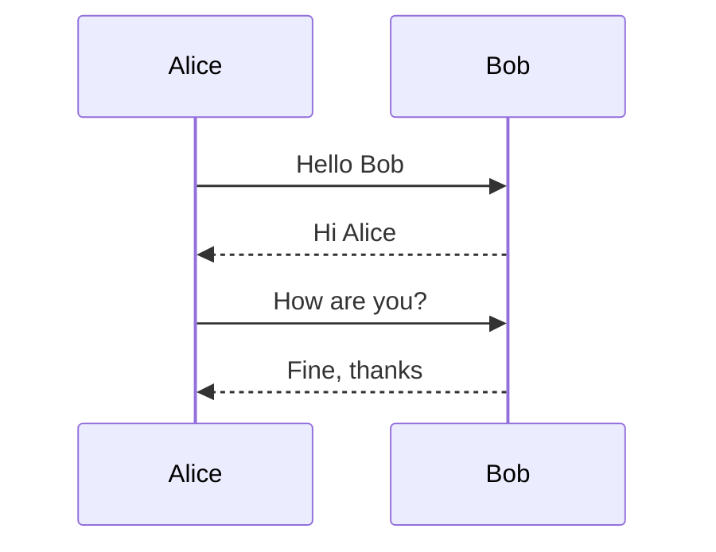
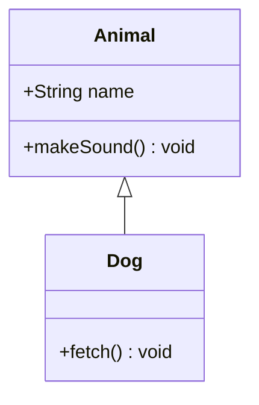

# Valid Mermaid Diagrams

Three diagrams that must all parse without error.

```mermaid
flowchart LR
    A[Start] --> B{Decision}
    B -->|yes| C[Do it]
    B -->|no| D[Skip]
    C --> E[End]
    D --> E
```

```mermaid
sequenceDiagram
    Alice->>Bob: Hello Bob
    Bob-->>Alice: Hi Alice
    Alice->>Bob: How are you?
    Bob-->>Alice: Fine, thanks
```

```mermaid
classDiagram
    class Animal {
        +String name
        +makeSound() void
    }
    class Dog {
        +fetch() void
    }
    Animal <|-- Dog
```
