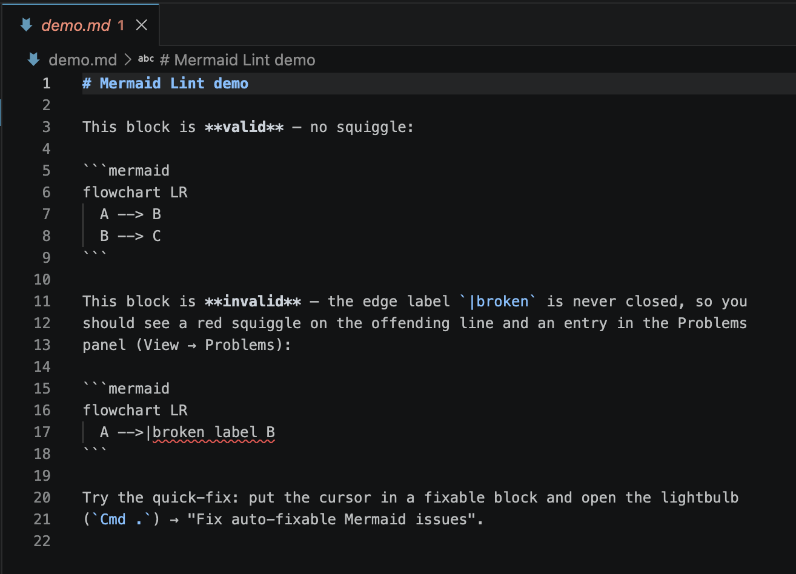

# Mermaid Lint for VS Code

Live [Mermaid](https://mermaid.js.org/) diagram validation, right in the editor.
Invalid diagrams get red squiggles as you type — in Markdown fenced
` ```mermaid ` blocks **and** in standalone `.mmd` files.

Powered by [`@mermaid-lint/core`](https://www.npmjs.com/package/@mermaid-lint/core),
the same engine behind the `mermaid-lint` CLI, so the editor matches CI.

## Screenshots

Invalid block in a Markdown file — red squiggle + Problems-panel entry:



Standalone `.mmd` file (coverage the markdownlint rule can't provide):


## Features

- **Inline diagnostics** on invalid Mermaid in `.md` / `.markdown` fenced blocks
  and in `.mmd` files — hover for the error message.
- **Problems panel** entries that jump to the offending line.
- **Debounced on-type validation** — see errors as you edit, not just on save.
- **Quick-fix code actions** — apply mermaid-lint's mechanical autocorrections
  (`--fix`) without leaving the editor.
- **Config-aware** — respects your project's mermaid-lint config file
  (`.mermaidlintrc`, `mermaid-lint.config.js`, the `mermaidLint` key in
  `package.json`, …). `strict` and `semantic` settings carry over from the CLI.

## Settings

| Setting | Default | Description |
|---|---|---|
| `mermaidLint.enable` | `true` | Enable/disable validation. |
| `mermaidLint.delay` | `300` | Debounce delay (ms) before validating after a change. |

Whether semantic warnings are reported, and whether they are treated as errors
(`strict`), is read from your project's mermaid-lint config file rather than a
VS Code setting, so behavior matches `mermaid-lint` on the command line.

## Commands

- **Mermaid Lint: Re-lint open documents** (`mermaidLint.lintAllOpen`)

## Running from source

This extension lives in the [mermaid-lint](https://github.com/jasonworden/mermaid-lint)
monorepo. Build it once:

```bash
pnpm install
pnpm -r build
```

**Try it in VS Code (F5):** open the repo at its root in VS Code and press `F5`
(Run and Debug → "Run mermaid-lint-vscode (Extension Host)"). A second window
opens with the extension loaded and the [`demo/`](demo) folder — open `demo.md`
or `bad.mmd` to see live squiggles, hover messages, Problems-panel entries, and
the `Cmd .` quick-fix. See [`demo/README.md`](demo/README.md) for a walkthrough.

**Try it from a terminal** (no launch config needed):

```bash
code --extensionDevelopmentPath="$PWD/packages/vscode" --disable-extensions \
  "$PWD/packages/vscode/demo"
```

### Testing

```bash
pnpm test                                    # unit tests (pure logic, via root vitest)
pnpm --filter mermaid-lint-vscode test:e2e   # real VS Code host (@vscode/test-electron)
```

The e2e suite launches a real VS Code, loads the built extension, and asserts
diagnostics on the fixtures. It downloads a VS Code build into `.vscode-test/`
(gitignored). On Linux/CI it must run under a virtual display (`xvfb-run`); CI
does this in the `e2e` job. See [`AGENTS.md`](AGENTS.md) for build/architecture
invariants before changing the core integration.

## Status

Not yet published to the VS Code Marketplace. The packaging machinery is in
place (see below); publishing is a manual step that needs a Marketplace
publisher and token.

## Packaging & publishing

The extension does **not** bundle `@mermaid-lint/core` (it pulls in jsdom and
merman, which esbuild can't bundle), so the `.vsix` ships core + its dependency
tree as a flat `node_modules`. Because pnpm's symlinked `node_modules` can't be
packaged by `vsce`, [`scripts/package-vsix.sh`](scripts/package-vsix.sh) stages
a clean directory and installs core from **npm** with plain `npm install`.

**Prerequisite:** the matching `@mermaid-lint/core` version must be published to
npm first. The monorepo publishes on a version tag:

```bash
git tag v0.11.0 && git push origin v0.11.0   # CI publishes @mermaid-lint/* to npm
```

Then build the `.vsix`:

```bash
pnpm install
pnpm --filter mermaid-lint-vscode package
# → packages/vscode/mermaid-lint-vscode-<version>.vsix
# (override the core version for testing: --core-version 0.9.0)
```

Publish it (needs a [publisher](https://code.visualstudio.com/api/working-with-extensions/publishing-extension)
matching the `publisher` field and a Personal Access Token):

```bash
pnpm --filter mermaid-lint-vscode exec vsce publish \
  --packagePath mermaid-lint-vscode-<version>.vsix --pat <token>
```

The produced `.vsix` is ~25 MB (jsdom + mermaid). It has been verified to load
and validate `.md`/`.mmd` from the packaged `node_modules`. No icon is set yet;
add one (`icon` in `package.json` + a 128×128 PNG) before publishing for a
nicer Marketplace listing.

## Relationship to `@mermaid-lint/markdownlint`

If you already use the [markdownlint](https://github.com/DavidAnson/markdownlint)
VS Code extension, [`@mermaid-lint/markdownlint`](https://www.npmjs.com/package/@mermaid-lint/markdownlint)
gives you Mermaid squiggles in `.md` files through that toolchain. This dedicated
extension additionally covers `.mmd` files and offers quick-fixes, and needs no
markdownlint configuration.
