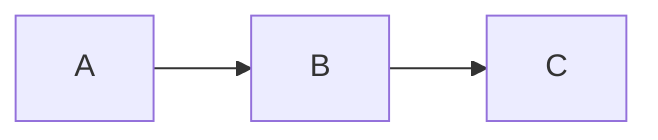

# Mermaid Lint demo

This block is **valid** — no squiggle:



This block is **invalid** — the edge label `|broken` is never closed, so you
should see a red squiggle on the offending line and an entry in the Problems
panel (View → Problems):

```mermaid
flowchart LR
  A -->|broken label B
```

Try the quick-fix: put the cursor in a fixable block and open the lightbulb
(`Cmd .`) → "Fix auto-fixable Mermaid issues".
